# Diagramas Mermaid — Comercia (módulo n8n)

Cada bloque corresponde a una figura del documento `Comercia_Documentacion_Tecnica_n8n.docx`, en el mismo orden.

## Cómo generar las imágenes

1. Abra https://mermaid.live
2. Pegue el contenido del bloque (sin las comillas triples) en el panel izquierdo.
3. Use **Actions → PNG** (o SVG) para descargar.

La primera línea `%%{init: ...}%%` solo ajusta el espaciado para que el diagrama sea compacto; si le da problemas, puede borrarla.

---

## Figura 1. Arquitectura general del módulo n8n de Comercia

Archivo: `00a_arquitectura_general.mmd`

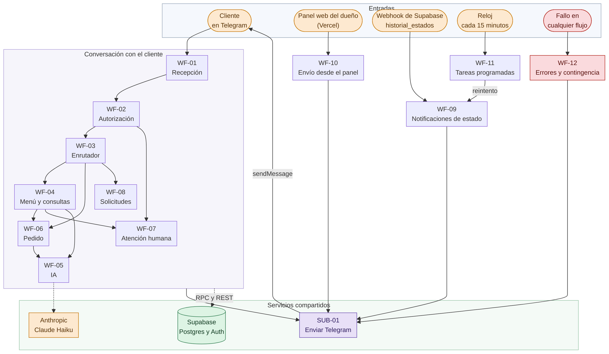
```mermaid
%%{init: {"flowchart": {"nodeSpacing": 22, "rankSpacing": 26, "padding": 6, "curve": "basis", "useMaxWidth": false}, "themeVariables": {"fontSize": "14px"}}}%%
flowchart TB
  subgraph IN["Entradas"]
    direction LR
    CLI(["Cliente<br/>en Telegram"])
    PAN(["Panel web del dueño<br/>(Vercel)"])
    DBW(["Webhook de Supabase<br/>historial_estados"])
    CRON(["Reloj<br/>cada 15 minutos"])
    ERR(["Fallo en<br/>cualquier flujo"])
  end
  subgraph CONV["Conversación con el cliente"]
    direction LR
    W01["WF-01<br/>Recepción"] --> W02["WF-02<br/>Autorización"]
    W02 --> W03["WF-03<br/>Enrutador"]
    W02 --> W07["WF-07<br/>Atención humana"]
    W03 --> W04["WF-04<br/>Menú y consultas"]
    W03 --> W06["WF-06<br/>Pedido"]
    W03 --> W08["WF-08<br/>Solicitudes"]
    W04 --> W06
    W04 --> W07
    W04 --> W05["WF-05<br/>IA"]
    W06 --> W05
  end
  W09["WF-09<br/>Notificaciones de estado"]
  W10["WF-10<br/>Envío desde el panel"]
  W11["WF-11<br/>Tareas programadas"]
  W12["WF-12<br/>Errores y contingencia"]
  CLI --> W01
  PAN --> W10
  DBW --> W09
  CRON --> W11
  W11 -->|"reintento"| W09
  ERR --> W12
  subgraph SH["Servicios compartidos"]
    direction LR
    S01["SUB-01<br/>Enviar Telegram"]
    DB[("Supabase<br/>Postgres y Auth")]
    IA["Anthropic<br/>Claude Haiku"]
  end
  CONV --> S01
  W09 --> S01
  W10 --> S01
  W12 --> S01
  S01 -->|"sendMessage"| CLI
  CONV -.->|"RPC y REST"| DB
  W05 -.-> IA

  classDef trig fill:#DCEBFA,stroke:#1F5FA8,color:#0B2E57
  classDef sub fill:#E8E0F7,stroke:#6B4FB0,color:#2C1A5E
  classDef db fill:#DDF3E4,stroke:#2E7D4F,color:#0E3B20
  classDef ext fill:#FDE8D0,stroke:#C77700,color:#5A3300
  classDef err fill:#FADADD,stroke:#B3261E,color:#5C0F0A
  classDef nota fill:#F3F3F3,stroke:#888888,color:#333333,stroke-dasharray: 4 3
  class CLI,PAN,DBW,CRON ext
  class ERR,W12 err
  class DB db
  class IA ext
  class S01 sub

  style IN fill:#F5F8FC,stroke:#9AA9BC
  style CONV fill:#F7F5FC,stroke:#B3A5D9
  style SH fill:#F4FAF6,stroke:#9CC7AB
```

## Figura 2. Ciclo de vida de un mensaje de cliente

Archivo: `00b_ciclo_de_vida_de_un_mensaje.mmd`

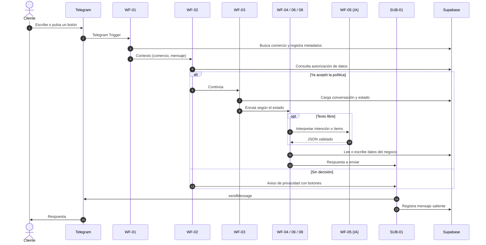
```mermaid
sequenceDiagram
  autonumber
  actor C as Cliente
  participant TG as Telegram
  participant W1 as WF-01
  participant W2 as WF-02
  participant W3 as WF-03
  participant W4 as WF-04 / 06 / 08
  participant W5 as WF-05 (IA)
  participant S1 as SUB-01
  participant DB as Supabase
  C->>TG: Escribe o pulsa un botón
  TG->>W1: Telegram Trigger
  W1->>DB: Busca comercio y registra metadatos
  W1->>W2: Contexto (comercio, mensaje)
  W2->>DB: Consulta autorización de datos
  alt Ya aceptó la política
    W2->>W3: Continúa
    W3->>DB: Carga conversación y estado
    W3->>W4: Enruta según el estado
    opt Texto libre
      W4->>W5: Interpretar intención o ítems
      W5-->>W4: JSON validado
    end
    W4->>DB: Lee o escribe datos del negocio
    W4->>S1: Respuesta a enviar
  else Sin decisión
    W2->>S1: Aviso de privacidad con botones
  end
  S1->>TG: sendMessage
  S1->>DB: Registra mensaje saliente
  TG->>C: Respuesta
```

## Figura 3. WF-01: recepción del evento y validación del comercio

Archivo: `01a_WF-01_recepcion_y_comercio.mmd`

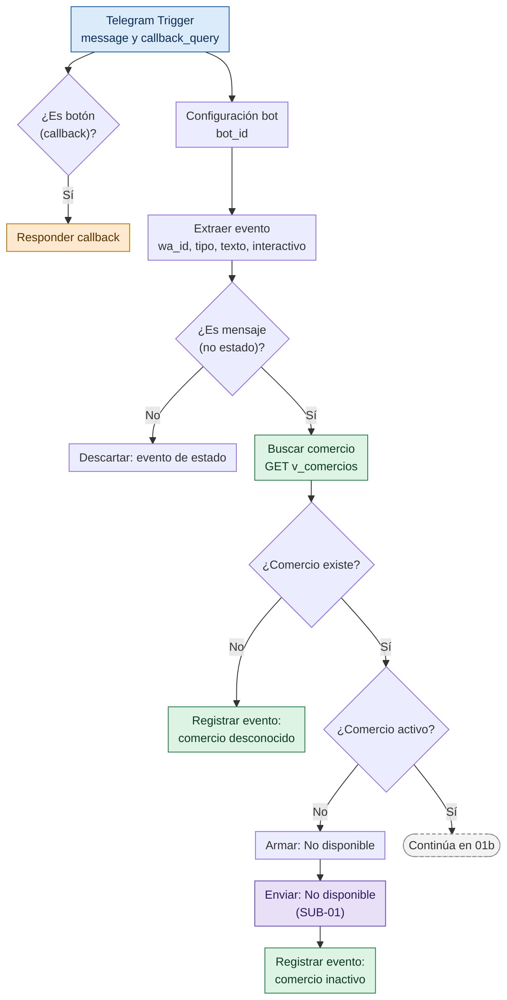
```mermaid
%%{init: {"flowchart": {"nodeSpacing": 22, "rankSpacing": 26, "padding": 6, "curve": "basis", "useMaxWidth": false}, "themeVariables": {"fontSize": "14px"}}}%%
flowchart TD
  T["Telegram Trigger<br/>message y callback_query"]
  T --> CB{"¿Es botón<br/>(callback)?"}
  CB -->|Sí| RC["Responder callback"]
  T --> CFG["Configuración bot<br/>bot_id"]
  CFG --> EX["Extraer evento<br/>wa_id, tipo, texto, interactivo"]
  EX --> ESM{"¿Es mensaje<br/>(no estado)?"}
  ESM -->|No| D1["Descartar: evento de estado"]
  ESM -->|Sí| BC["Buscar comercio<br/>GET v_comercios"]
  BC --> EXI{"¿Comercio existe?"}
  EXI -->|No| RD["Registrar evento:<br/>comercio desconocido"]
  EXI -->|Sí| ACT{"¿Comercio activo?"}
  ACT -->|No| NA["Armar: No disponible"]
  NA --> EN["Enviar: No disponible<br/>(SUB-01)"]
  EN --> RI["Registrar evento:<br/>comercio inactivo"]
  ACT -->|Sí| CONT(["Continúa en 01b"])

  classDef trig fill:#DCEBFA,stroke:#1F5FA8,color:#0B2E57
  classDef sub fill:#E8E0F7,stroke:#6B4FB0,color:#2C1A5E
  classDef db fill:#DDF3E4,stroke:#2E7D4F,color:#0E3B20
  classDef ext fill:#FDE8D0,stroke:#C77700,color:#5A3300
  classDef err fill:#FADADD,stroke:#B3261E,color:#5C0F0A
  classDef nota fill:#F3F3F3,stroke:#888888,color:#333333,stroke-dasharray: 4 3
  class T trig
  class EN sub
  class BC,RD,RI db
  class RC ext
  class CONT nota
```

## Figura 4. WF-01: registro de metadatos e idempotencia

Archivo: `01b_WF-01_registro_e_idempotencia.mmd`

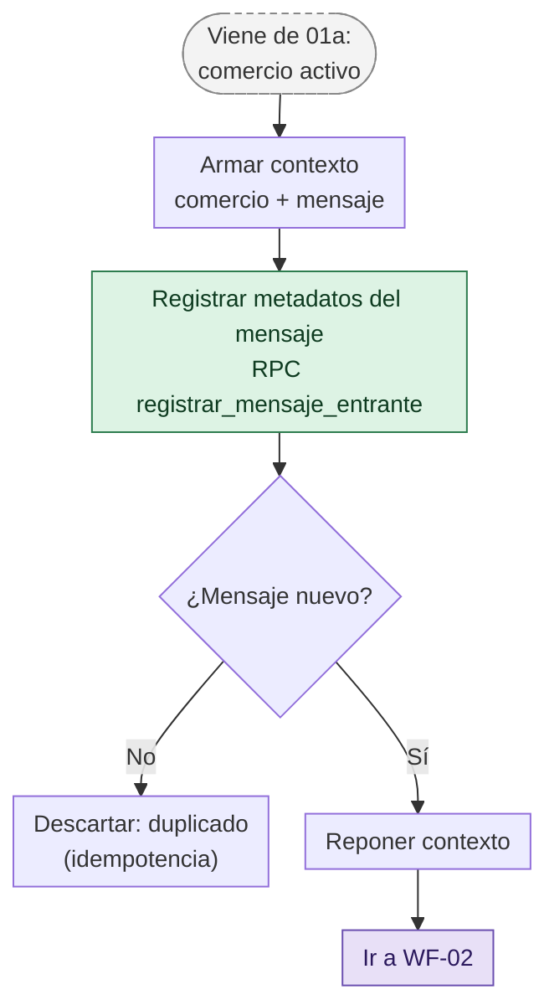
```mermaid
%%{init: {"flowchart": {"nodeSpacing": 22, "rankSpacing": 26, "padding": 6, "curve": "basis", "useMaxWidth": false}, "themeVariables": {"fontSize": "14px"}}}%%
flowchart TD
  ST(["Viene de 01a:<br/>comercio activo"])
  ST --> AC["Armar contexto<br/>comercio + mensaje"]
  AC --> RM["Registrar metadatos del mensaje<br/>RPC registrar_mensaje_entrante"]
  RM --> NUE{"¿Mensaje nuevo?"}
  NUE -->|No| DUP["Descartar: duplicado<br/>(idempotencia)"]
  NUE -->|Sí| RP["Reponer contexto"]
  RP --> W2["Ir a WF-02"]

  classDef trig fill:#DCEBFA,stroke:#1F5FA8,color:#0B2E57
  classDef sub fill:#E8E0F7,stroke:#6B4FB0,color:#2C1A5E
  classDef db fill:#DDF3E4,stroke:#2E7D4F,color:#0E3B20
  classDef ext fill:#FDE8D0,stroke:#C77700,color:#5A3300
  classDef err fill:#FADADD,stroke:#B3261E,color:#5C0F0A
  classDef nota fill:#F3F3F3,stroke:#888888,color:#333333,stroke-dasharray: 4 3
  class W2 sub
  class RM db
  class ST nota
```

## Figura 5. WF-02: control de autorización y rutas de decisión

Archivo: `02_WF-02_control_de_autorizacion.mmd`

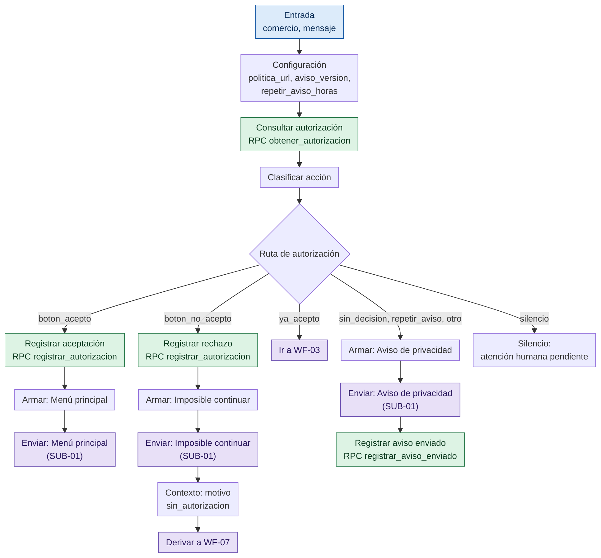
```mermaid
%%{init: {"flowchart": {"nodeSpacing": 22, "rankSpacing": 26, "padding": 6, "curve": "basis", "useMaxWidth": false}, "themeVariables": {"fontSize": "14px"}}}%%
flowchart TD
  E["Entrada<br/>comercio, mensaje"]
  E --> CF["Configuración<br/>politica_url, aviso_version,<br/>repetir_aviso_horas"]
  CF --> CA["Consultar autorización<br/>RPC obtener_autorizacion"]
  CA --> CL["Clasificar acción"]
  CL --> SW{"Ruta de autorización"}
  SW -->|boton_acepto| RA["Registrar aceptación<br/>RPC registrar_autorizacion"]
  RA --> MP["Armar: Menú principal"]
  MP --> EM["Enviar: Menú principal<br/>(SUB-01)"]
  SW -->|boton_no_acepto| RR["Registrar rechazo<br/>RPC registrar_autorizacion"]
  RR --> IC["Armar: Imposible continuar"]
  IC --> EI["Enviar: Imposible continuar<br/>(SUB-01)"]
  EI --> CM["Contexto: motivo<br/>sin_autorizacion"]
  CM --> W7["Derivar a WF-07"]
  SW -->|ya_acepto| W3["Ir a WF-03"]
  SW -->|"sin_decision, repetir_aviso, otro"| AP["Armar: Aviso de privacidad"]
  AP --> EP["Enviar: Aviso de privacidad<br/>(SUB-01)"]
  EP --> RAE["Registrar aviso enviado<br/>RPC registrar_aviso_enviado"]
  SW -->|silencio| SI["Silencio:<br/>atención humana pendiente"]

  classDef trig fill:#DCEBFA,stroke:#1F5FA8,color:#0B2E57
  classDef sub fill:#E8E0F7,stroke:#6B4FB0,color:#2C1A5E
  classDef db fill:#DDF3E4,stroke:#2E7D4F,color:#0E3B20
  classDef ext fill:#FDE8D0,stroke:#C77700,color:#5A3300
  classDef err fill:#FADADD,stroke:#B3261E,color:#5C0F0A
  class E trig
  class EM,EI,EP,W7,W3 sub
  class CA,RA,RR,RAE db
```

## Figura 6. WF-03: carga de contexto y enrutamiento por estado

Archivo: `03_WF-03_enrutador_por_estado.mmd`

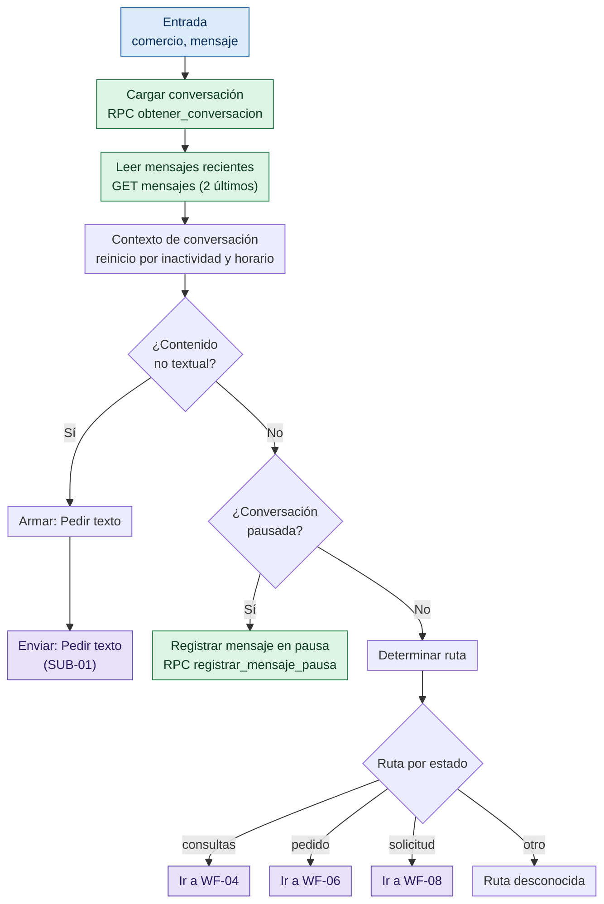
```mermaid
%%{init: {"flowchart": {"nodeSpacing": 22, "rankSpacing": 26, "padding": 6, "curve": "basis", "useMaxWidth": false}, "themeVariables": {"fontSize": "14px"}}}%%
flowchart TD
  E["Entrada<br/>comercio, mensaje"]
  E --> CC["Cargar conversación<br/>RPC obtener_conversacion"]
  CC --> LM["Leer mensajes recientes<br/>GET mensajes (2 últimos)"]
  LM --> CX["Contexto de conversación<br/>reinicio por inactividad y horario"]
  CX --> NT{"¿Contenido<br/>no textual?"}
  NT -->|Sí| PT["Armar: Pedir texto"]
  PT --> EPT["Enviar: Pedir texto<br/>(SUB-01)"]
  NT -->|No| PA{"¿Conversación<br/>pausada?"}
  PA -->|Sí| RMP["Registrar mensaje en pausa<br/>RPC registrar_mensaje_pausa"]
  PA -->|No| DR["Determinar ruta"]
  DR --> RS{"Ruta por estado"}
  RS -->|consultas| W4["Ir a WF-04"]
  RS -->|pedido| W6["Ir a WF-06"]
  RS -->|solicitud| W8["Ir a WF-08"]
  RS -->|otro| RD["Ruta desconocida"]

  classDef trig fill:#DCEBFA,stroke:#1F5FA8,color:#0B2E57
  classDef sub fill:#E8E0F7,stroke:#6B4FB0,color:#2C1A5E
  classDef db fill:#DDF3E4,stroke:#2E7D4F,color:#0E3B20
  classDef ext fill:#FDE8D0,stroke:#C77700,color:#5A3300
  classDef err fill:#FADADD,stroke:#B3261E,color:#5C0F0A
  class E trig
  class EPT,W4,W6,W8 sub
  class CC,LM,RMP db
```

## Figura 7. WF-04: resolución de la opción, menú, catálogo, estado y no entendido

Archivo: `04a_WF-04_menu_catalogo_estado.mmd`

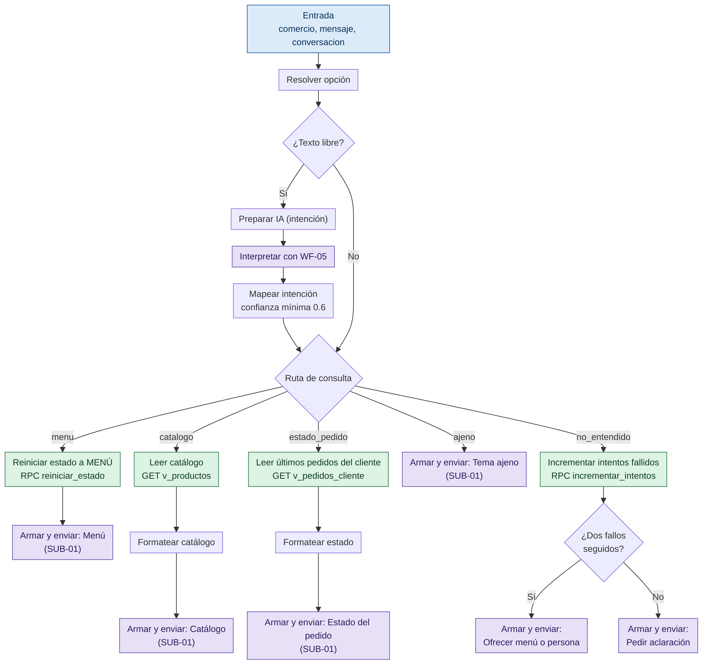
```mermaid
%%{init: {"flowchart": {"nodeSpacing": 22, "rankSpacing": 26, "padding": 6, "curve": "basis", "useMaxWidth": false}, "themeVariables": {"fontSize": "14px"}}}%%
flowchart TD
  E["Entrada<br/>comercio, mensaje, conversacion"]
  E --> RO["Resolver opción"]
  RO --> TL{"¿Texto libre?"}
  TL -->|Sí| PI["Preparar IA (intención)"]
  PI --> WI["Interpretar con WF-05"]
  WI --> MI["Mapear intención<br/>confianza mínima 0.6"]
  MI --> RC
  TL -->|No| RC{"Ruta de consulta"}
  RC -->|menu| RE["Reiniciar estado a MENÚ<br/>RPC reiniciar_estado"]
  RE --> M1["Armar y enviar: Menú<br/>(SUB-01)"]
  RC -->|catalogo| LC["Leer catálogo<br/>GET v_productos"]
  LC --> FC["Formatear catálogo"]
  FC --> M2["Armar y enviar: Catálogo<br/>(SUB-01)"]
  RC -->|estado_pedido| LP["Leer últimos pedidos del cliente<br/>GET v_pedidos_cliente"]
  LP --> FE["Formatear estado"]
  FE --> M3["Armar y enviar: Estado del pedido<br/>(SUB-01)"]
  RC -->|ajeno| M4["Armar y enviar: Tema ajeno<br/>(SUB-01)"]
  RC -->|no_entendido| II["Incrementar intentos fallidos<br/>RPC incrementar_intentos"]
  II --> DF{"¿Dos fallos<br/>seguidos?"}
  DF -->|Sí| M5["Armar y enviar:<br/>Ofrecer menú o persona"]
  DF -->|No| M6["Armar y enviar:<br/>Pedir aclaración"]

  classDef trig fill:#DCEBFA,stroke:#1F5FA8,color:#0B2E57
  classDef sub fill:#E8E0F7,stroke:#6B4FB0,color:#2C1A5E
  classDef db fill:#DDF3E4,stroke:#2E7D4F,color:#0E3B20
  classDef ext fill:#FDE8D0,stroke:#C77700,color:#5A3300
  classDef err fill:#FADADD,stroke:#B3261E,color:#5C0F0A
  class E trig
  class WI,M1,M2,M3,M4,M5,M6 sub
  class RE,LC,LP,II db
```

## Figura 8. WF-04: preguntas frecuentes, inicio de pedido y atención humana

Archivo: `04b_WF-04_faq_pedido_persona.mmd`

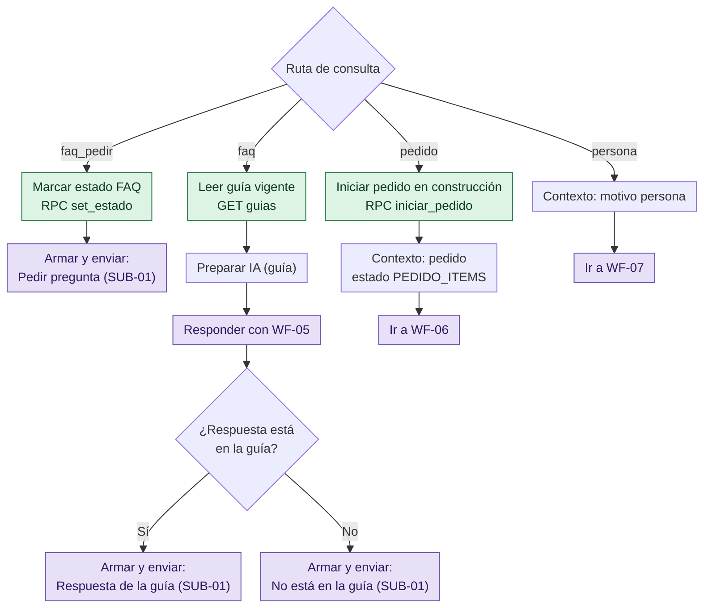
```mermaid
%%{init: {"flowchart": {"nodeSpacing": 22, "rankSpacing": 26, "padding": 6, "curve": "basis", "useMaxWidth": false}, "themeVariables": {"fontSize": "14px"}}}%%
flowchart TD
  RC{"Ruta de consulta"}
  RC -->|faq_pedir| MF["Marcar estado FAQ<br/>RPC set_estado"]
  MF --> PP["Armar y enviar:<br/>Pedir pregunta (SUB-01)"]
  RC -->|faq| LG["Leer guía vigente<br/>GET guias"]
  LG --> PG["Preparar IA (guía)"]
  PG --> WG["Responder con WF-05"]
  WG --> EG{"¿Respuesta está<br/>en la guía?"}
  EG -->|Sí| RG["Armar y enviar:<br/>Respuesta de la guía (SUB-01)"]
  EG -->|No| NG["Armar y enviar:<br/>No está en la guía (SUB-01)"]
  RC -->|pedido| IP["Iniciar pedido en construcción<br/>RPC iniciar_pedido"]
  IP --> CP["Contexto: pedido<br/>estado PEDIDO_ITEMS"]
  CP --> W6["Ir a WF-06"]
  RC -->|persona| CMP["Contexto: motivo persona"]
  CMP --> W7["Ir a WF-07"]

  classDef trig fill:#DCEBFA,stroke:#1F5FA8,color:#0B2E57
  classDef sub fill:#E8E0F7,stroke:#6B4FB0,color:#2C1A5E
  classDef db fill:#DDF3E4,stroke:#2E7D4F,color:#0E3B20
  classDef ext fill:#FDE8D0,stroke:#C77700,color:#5A3300
  classDef err fill:#FADADD,stroke:#B3261E,color:#5C0F0A
  class WG,PP,RG,NG,W6,W7 sub
  class MF,LG,IP db
```

## Figura 9. WF-05: llamada a la IA con validación de salida

Archivo: `05_WF-05_subflujo_de_ia.mmd`

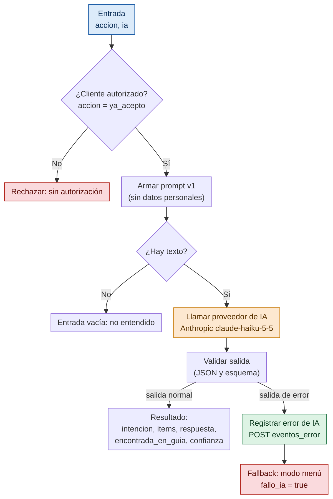
```mermaid
%%{init: {"flowchart": {"nodeSpacing": 22, "rankSpacing": 26, "padding": 6, "curve": "basis", "useMaxWidth": false}, "themeVariables": {"fontSize": "14px"}}}%%
flowchart TD
  E["Entrada<br/>accion, ia"]
  E --> AU{"¿Cliente autorizado?<br/>accion = ya_acepto"}
  AU -->|No| RZ["Rechazar: sin autorización"]
  AU -->|Sí| AP["Armar prompt v1<br/>(sin datos personales)"]
  AP --> HT{"¿Hay texto?"}
  HT -->|No| EV["Entrada vacía: no entendido"]
  HT -->|Sí| LL["Llamar proveedor de IA<br/>Anthropic claude-haiku-5-5"]
  LL --> VS["Validar salida<br/>(JSON y esquema)"]
  VS -->|salida normal| OUT["Resultado:<br/>intencion, items, respuesta,<br/>encontrada_en_guia, confianza"]
  VS -->|salida de error| RE["Registrar error de IA<br/>POST eventos_error"]
  RE --> FB["Fallback: modo menú<br/>fallo_ia = true"]

  classDef trig fill:#DCEBFA,stroke:#1F5FA8,color:#0B2E57
  classDef sub fill:#E8E0F7,stroke:#6B4FB0,color:#2C1A5E
  classDef db fill:#DDF3E4,stroke:#2E7D4F,color:#0E3B20
  classDef ext fill:#FDE8D0,stroke:#C77700,color:#5A3300
  classDef err fill:#FADADD,stroke:#B3261E,color:#5C0F0A
  class E trig
  class LL ext
  class RE db
  class RZ,FB err
```

## Figura 10. WF-06: subestados del pedido

Archivo: `06c_WF-06_estados_del_pedido.mmd`

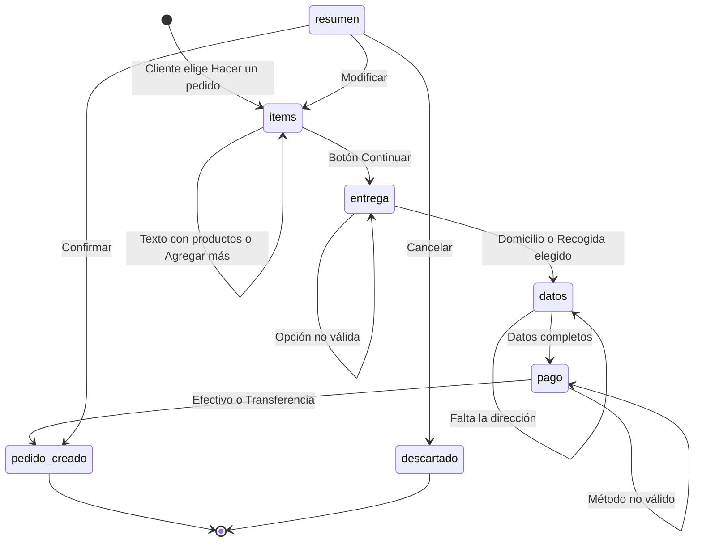
```mermaid
stateDiagram-v2
  [*] --> items: Cliente elige Hacer un pedido
  items --> items: Texto con productos o Agregar más
  items --> entrega: Botón Continuar
  entrega --> entrega: Opción no válida
  entrega --> datos: Domicilio o Recogida elegido
  datos --> datos: Falta la dirección
  datos --> pago: Datos completos
  pago --> pedido_creado: Efectivo o Transferencia
  pago --> pago: Método no válido
  resumen --> pedido_creado: Confirmar
  resumen --> items: Modificar
  resumen --> descartado: Cancelar
  pedido_creado --> [*]
  descartado --> [*]
```

## Figura 11. WF-06: carga del carrito, subestado y paso de ítems

Archivo: `06a1_WF-06_pedido_subestados_y_continuar.mmd`

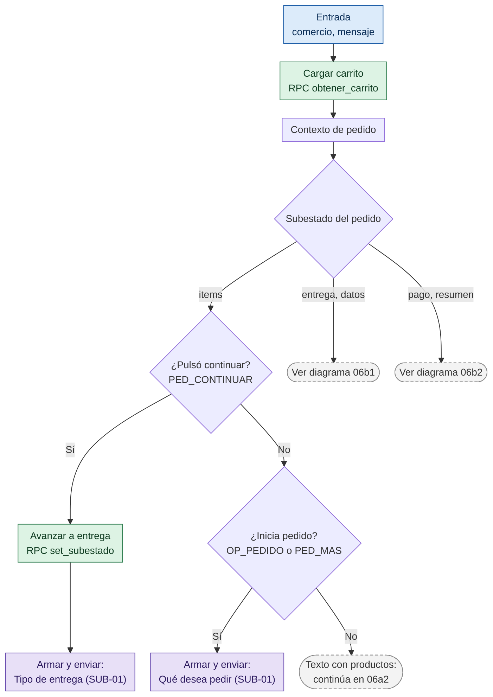
```mermaid
%%{init: {"flowchart": {"nodeSpacing": 22, "rankSpacing": 26, "padding": 6, "curve": "basis", "useMaxWidth": false}, "themeVariables": {"fontSize": "14px"}}}%%
flowchart TD
  E["Entrada<br/>comercio, mensaje"]
  E --> CC["Cargar carrito<br/>RPC obtener_carrito"]
  CC --> CP["Contexto de pedido"]
  CP --> SS{"Subestado del pedido"}
  SS -->|items| PC{"¿Pulsó continuar?<br/>PED_CONTINUAR"}
  PC -->|Sí| AE["Avanzar a entrega<br/>RPC set_subestado"]
  AE --> TE["Armar y enviar:<br/>Tipo de entrega (SUB-01)"]
  PC -->|No| IP{"¿Inicia pedido?<br/>OP_PEDIDO o PED_MAS"}
  IP -->|Sí| QD["Armar y enviar:<br/>Qué desea pedir (SUB-01)"]
  IP -->|No| CONT(["Texto con productos:<br/>continúa en 06a2"])
  SS -->|"entrega, datos"| R1(["Ver diagrama 06b1"])
  SS -->|"pago, resumen"| R2(["Ver diagrama 06b2"])

  classDef trig fill:#DCEBFA,stroke:#1F5FA8,color:#0B2E57
  classDef sub fill:#E8E0F7,stroke:#6B4FB0,color:#2C1A5E
  classDef db fill:#DDF3E4,stroke:#2E7D4F,color:#0E3B20
  classDef ext fill:#FDE8D0,stroke:#C77700,color:#5A3300
  classDef err fill:#FADADD,stroke:#B3261E,color:#5C0F0A
  classDef nota fill:#F3F3F3,stroke:#888888,color:#333333,stroke-dasharray: 4 3
  class E trig
  class TE,QD sub
  class CC,AE db
  class CONT,R1,R2 nota
```

## Figura 12. WF-06: interpretación de ítems con IA y resolución contra el catálogo

Archivo: `06a2_WF-06_interpretar_items_con_ia.mmd`

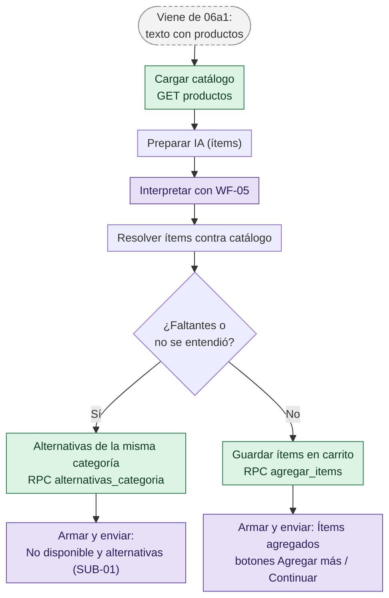
```mermaid
%%{init: {"flowchart": {"nodeSpacing": 22, "rankSpacing": 26, "padding": 6, "curve": "basis", "useMaxWidth": false}, "themeVariables": {"fontSize": "14px"}}}%%
flowchart TD
  ST(["Viene de 06a1:<br/>texto con productos"])
  ST --> CAT["Cargar catálogo<br/>GET productos"]
  CAT --> PI["Preparar IA (ítems)"]
  PI --> WI["Interpretar con WF-05"]
  WI --> RI["Resolver ítems contra catálogo"]
  RI --> HF{"¿Faltantes o<br/>no se entendió?"}
  HF -->|Sí| ALT["Alternativas de la misma categoría<br/>RPC alternativas_categoria"]
  ALT --> NDA["Armar y enviar:<br/>No disponible y alternativas (SUB-01)"]
  HF -->|No| GI["Guardar ítems en carrito<br/>RPC agregar_items"]
  GI --> IA["Armar y enviar: Ítems agregados<br/>botones Agregar más / Continuar"]

  classDef trig fill:#DCEBFA,stroke:#1F5FA8,color:#0B2E57
  classDef sub fill:#E8E0F7,stroke:#6B4FB0,color:#2C1A5E
  classDef db fill:#DDF3E4,stroke:#2E7D4F,color:#0E3B20
  classDef ext fill:#FDE8D0,stroke:#C77700,color:#5A3300
  classDef err fill:#FADADD,stroke:#B3261E,color:#5C0F0A
  classDef nota fill:#F3F3F3,stroke:#888888,color:#333333,stroke-dasharray: 4 3
  class WI,NDA,IA sub
  class CAT,ALT,GI db
  class ST nota
```

## Figura 13. WF-06: entrega y datos del cliente

Archivo: `06b1_WF-06_entrega_y_datos.mmd`

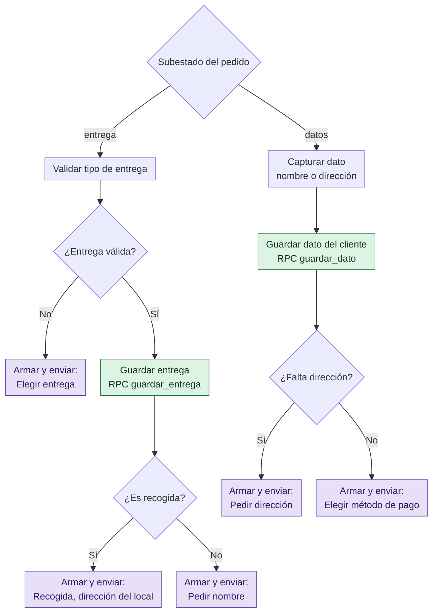
```mermaid
%%{init: {"flowchart": {"nodeSpacing": 22, "rankSpacing": 26, "padding": 6, "curve": "basis", "useMaxWidth": false}, "themeVariables": {"fontSize": "14px"}}}%%
flowchart TD
  SS{"Subestado del pedido"}
  SS -->|entrega| VE["Validar tipo de entrega"]
  VE --> EV{"¿Entrega válida?"}
  EV -->|No| REn["Armar y enviar:<br/>Elegir entrega"]
  EV -->|Sí| GE["Guardar entrega<br/>RPC guardar_entrega"]
  GE --> ER{"¿Es recogida?"}
  ER -->|Sí| RD["Armar y enviar:<br/>Recogida, dirección del local"]
  ER -->|No| PN["Armar y enviar:<br/>Pedir nombre"]
  SS -->|datos| CD["Capturar dato<br/>nombre o dirección"]
  CD --> GD["Guardar dato del cliente<br/>RPC guardar_dato"]
  GD --> FD{"¿Falta dirección?"}
  FD -->|Sí| PD["Armar y enviar:<br/>Pedir dirección"]
  FD -->|No| MP["Armar y enviar:<br/>Elegir método de pago"]

  classDef trig fill:#DCEBFA,stroke:#1F5FA8,color:#0B2E57
  classDef sub fill:#E8E0F7,stroke:#6B4FB0,color:#2C1A5E
  classDef db fill:#DDF3E4,stroke:#2E7D4F,color:#0E3B20
  classDef ext fill:#FDE8D0,stroke:#C77700,color:#5A3300
  classDef err fill:#FADADD,stroke:#B3261E,color:#5C0F0A
  classDef nota fill:#F3F3F3,stroke:#888888,color:#333333,stroke-dasharray: 4 3
  class GE,GD db
  class REn,RD,PN,PD,MP sub
```

## Figura 14. WF-06: pago, resumen y creación del pedido

Archivo: `06b2_WF-06_pago_y_cierre.mmd`

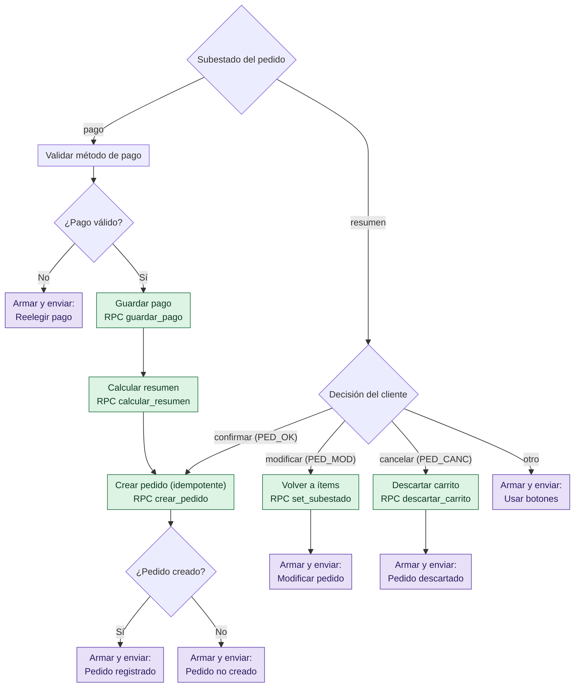
```mermaid
%%{init: {"flowchart": {"nodeSpacing": 22, "rankSpacing": 26, "padding": 6, "curve": "basis", "useMaxWidth": false}, "themeVariables": {"fontSize": "14px"}}}%%
flowchart TD
  SS{"Subestado del pedido"}
  SS -->|pago| VP["Validar método de pago"]
  VP --> PV{"¿Pago válido?"}
  PV -->|No| RP["Armar y enviar:<br/>Reelegir pago"]
  PV -->|Sí| GP["Guardar pago<br/>RPC guardar_pago"]
  GP --> CR["Calcular resumen<br/>RPC calcular_resumen"]
  CR --> CRE["Crear pedido (idempotente)<br/>RPC crear_pedido"]
  SS -->|resumen| DC{"Decisión del cliente"}
  DC -->|"confirmar (PED_OK)"| CRE
  DC -->|"modificar (PED_MOD)"| VI["Volver a ítems<br/>RPC set_subestado"]
  VI --> MPe["Armar y enviar:<br/>Modificar pedido"]
  DC -->|"cancelar (PED_CANC)"| DCa["Descartar carrito<br/>RPC descartar_carrito"]
  DCa --> PDs["Armar y enviar:<br/>Pedido descartado"]
  DC -->|otro| UB["Armar y enviar:<br/>Usar botones"]
  CRE --> PCr{"¿Pedido creado?"}
  PCr -->|Sí| PR["Armar y enviar:<br/>Pedido registrado"]
  PCr -->|No| PNC["Armar y enviar:<br/>Pedido no creado"]

  classDef trig fill:#DCEBFA,stroke:#1F5FA8,color:#0B2E57
  classDef sub fill:#E8E0F7,stroke:#6B4FB0,color:#2C1A5E
  classDef db fill:#DDF3E4,stroke:#2E7D4F,color:#0E3B20
  classDef ext fill:#FDE8D0,stroke:#C77700,color:#5A3300
  classDef err fill:#FADADD,stroke:#B3261E,color:#5C0F0A
  classDef nota fill:#F3F3F3,stroke:#888888,color:#333333,stroke-dasharray: 4 3
  class GP,CR,CRE,VI,DCa db
  class RP,MPe,PDs,UB,PR,PNC sub
```

## Figura 15. WF-07: derivación a una persona

Archivo: `07_WF-07_atencion_humana.mmd`

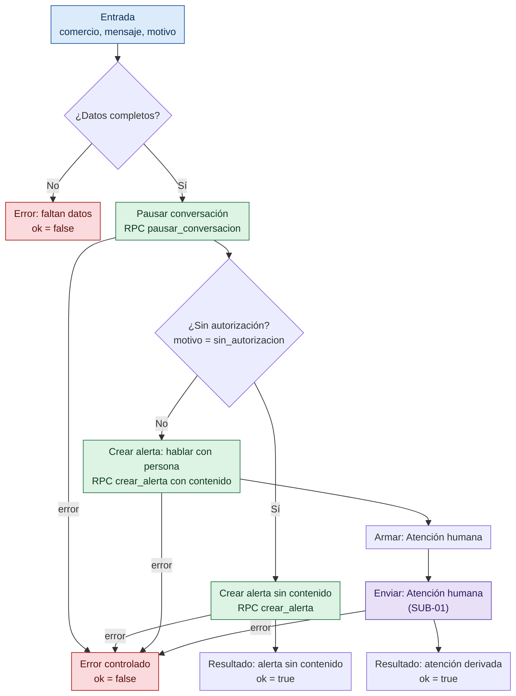
```mermaid
%%{init: {"flowchart": {"nodeSpacing": 22, "rankSpacing": 26, "padding": 6, "curve": "basis", "useMaxWidth": false}, "themeVariables": {"fontSize": "14px"}}}%%
flowchart TD
  E["Entrada<br/>comercio, mensaje, motivo"]
  E --> DC{"¿Datos completos?"}
  DC -->|No| EF["Error: faltan datos<br/>ok = false"]
  DC -->|Sí| PC["Pausar conversación<br/>RPC pausar_conversacion"]
  PC -->|error| EC["Error controlado<br/>ok = false"]
  PC --> SA{"¿Sin autorización?<br/>motivo = sin_autorizacion"}
  SA -->|Sí| A1["Crear alerta sin contenido<br/>RPC crear_alerta"]
  A1 --> R1["Resultado: alerta sin contenido<br/>ok = true"]
  A1 -->|error| EC
  SA -->|No| A2["Crear alerta: hablar con persona<br/>RPC crear_alerta con contenido"]
  A2 --> AH["Armar: Atención humana"]
  AH --> EH["Enviar: Atención humana<br/>(SUB-01)"]
  EH --> R2["Resultado: atención derivada<br/>ok = true"]
  A2 -->|error| EC
  EH -->|error| EC

  classDef trig fill:#DCEBFA,stroke:#1F5FA8,color:#0B2E57
  classDef sub fill:#E8E0F7,stroke:#6B4FB0,color:#2C1A5E
  classDef db fill:#DDF3E4,stroke:#2E7D4F,color:#0E3B20
  classDef ext fill:#FDE8D0,stroke:#C77700,color:#5A3300
  classDef err fill:#FADADD,stroke:#B3261E,color:#5C0F0A
  class E trig
  class EH sub
  class PC,A1,A2 db
  class EF,EC err
```

## Figura 16. WF-08: solicitud de modificación o cancelación

Archivo: `08_WF-08_solicitudes.mmd`

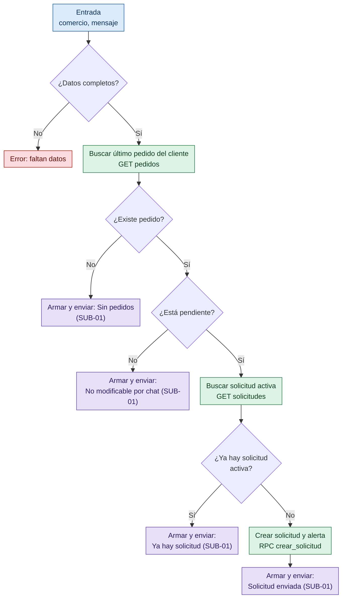
```mermaid
%%{init: {"flowchart": {"nodeSpacing": 22, "rankSpacing": 26, "padding": 6, "curve": "basis", "useMaxWidth": false}, "themeVariables": {"fontSize": "14px"}}}%%
flowchart TD
  E["Entrada<br/>comercio, mensaje"]
  E --> DC{"¿Datos completos?"}
  DC -->|No| EF["Error: faltan datos"]
  DC -->|Sí| BP["Buscar último pedido del cliente<br/>GET pedidos"]
  BP --> EP{"¿Existe pedido?"}
  EP -->|No| SP["Armar y enviar: Sin pedidos<br/>(SUB-01)"]
  EP -->|Sí| PE{"¿Está pendiente?"}
  PE -->|No| NM["Armar y enviar:<br/>No modificable por chat (SUB-01)"]
  PE -->|Sí| BS["Buscar solicitud activa<br/>GET solicitudes"]
  BS --> YS{"¿Ya hay solicitud<br/>activa?"}
  YS -->|Sí| YH["Armar y enviar:<br/>Ya hay solicitud (SUB-01)"]
  YS -->|No| CS["Crear solicitud y alerta<br/>RPC crear_solicitud"]
  CS --> SE["Armar y enviar:<br/>Solicitud enviada (SUB-01)"]

  classDef trig fill:#DCEBFA,stroke:#1F5FA8,color:#0B2E57
  classDef sub fill:#E8E0F7,stroke:#6B4FB0,color:#2C1A5E
  classDef db fill:#DDF3E4,stroke:#2E7D4F,color:#0E3B20
  classDef ext fill:#FDE8D0,stroke:#C77700,color:#5A3300
  classDef err fill:#FADADD,stroke:#B3261E,color:#5C0F0A
  class E trig
  class SP,NM,YH,SE sub
  class BP,BS,CS db
  class EF err
```

## Figura 17. WF-09: entradas, validación del secreto y decisión de avisar

Archivo: `09a_WF-09_entradas_y_decision.mmd`

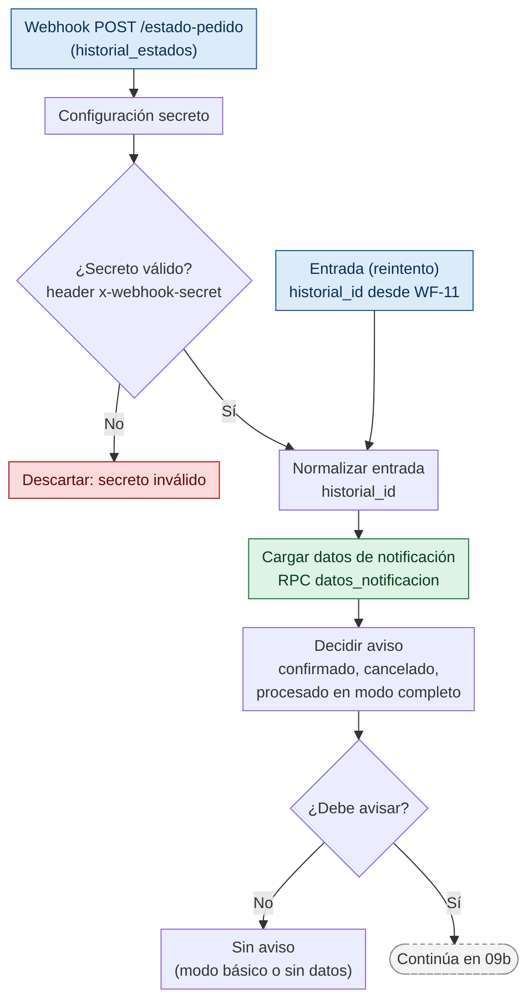
```mermaid
%%{init: {"flowchart": {"nodeSpacing": 22, "rankSpacing": 26, "padding": 6, "curve": "basis", "useMaxWidth": false}, "themeVariables": {"fontSize": "14px"}}}%%
flowchart TD
  W["Webhook POST /estado-pedido<br/>(historial_estados)"]
  W --> CS["Configuración secreto"]
  CS --> SV{"¿Secreto válido?<br/>header x-webhook-secret"}
  SV -->|No| DS["Descartar: secreto inválido"]
  SV -->|Sí| NE["Normalizar entrada<br/>historial_id"]
  ER["Entrada (reintento)<br/>historial_id desde WF-11"] --> NE
  NE --> CD["Cargar datos de notificación<br/>RPC datos_notificacion"]
  CD --> DA["Decidir aviso<br/>confirmado, cancelado,<br/>procesado en modo completo"]
  DA --> DB{"¿Debe avisar?"}
  DB -->|No| SA["Sin aviso<br/>(modo básico o sin datos)"]
  DB -->|Sí| CONT(["Continúa en 09b"])

  classDef trig fill:#DCEBFA,stroke:#1F5FA8,color:#0B2E57
  classDef sub fill:#E8E0F7,stroke:#6B4FB0,color:#2C1A5E
  classDef db fill:#DDF3E4,stroke:#2E7D4F,color:#0E3B20
  classDef ext fill:#FDE8D0,stroke:#C77700,color:#5A3300
  classDef err fill:#FADADD,stroke:#B3261E,color:#5C0F0A
  classDef nota fill:#F3F3F3,stroke:#888888,color:#333333,stroke-dasharray: 4 3
  class W,ER trig
  class CD db
  class DS err
  class CONT nota
```

## Figura 18. WF-09: envío del aviso y marcado del resultado

Archivo: `09b_WF-09_envio_y_marcado.mmd`

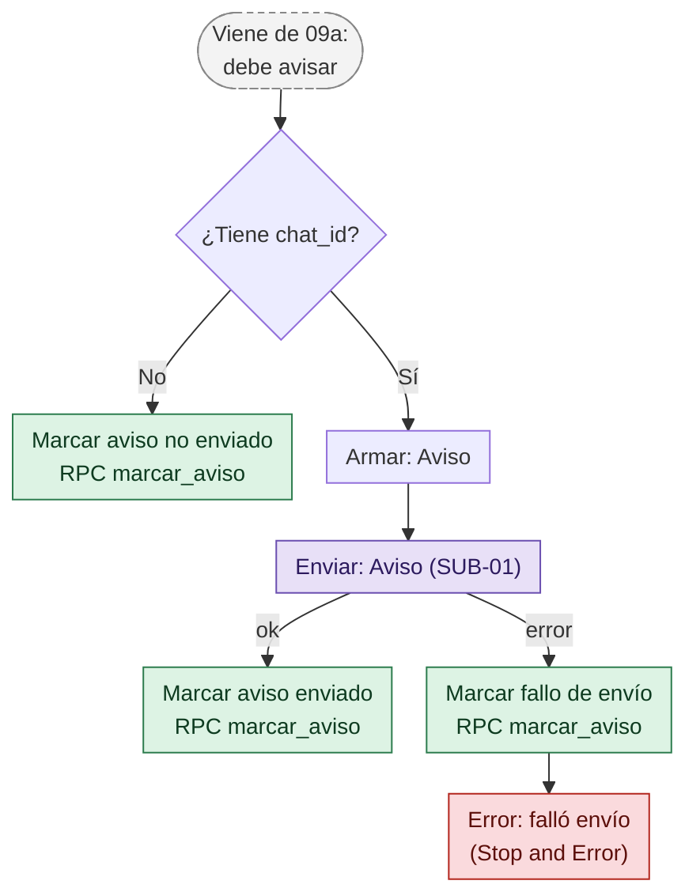
```mermaid
%%{init: {"flowchart": {"nodeSpacing": 22, "rankSpacing": 26, "padding": 6, "curve": "basis", "useMaxWidth": false}, "themeVariables": {"fontSize": "14px"}}}%%
flowchart TD
  ST(["Viene de 09a:<br/>debe avisar"])
  ST --> TC{"¿Tiene chat_id?"}
  TC -->|No| MN["Marcar aviso no enviado<br/>RPC marcar_aviso"]
  TC -->|Sí| AA["Armar: Aviso"]
  AA --> EA["Enviar: Aviso (SUB-01)"]
  EA -->|ok| ME["Marcar aviso enviado<br/>RPC marcar_aviso"]
  EA -->|error| MF["Marcar fallo de envío<br/>RPC marcar_aviso"]
  MF --> SE["Error: falló envío<br/>(Stop and Error)"]

  classDef trig fill:#DCEBFA,stroke:#1F5FA8,color:#0B2E57
  classDef sub fill:#E8E0F7,stroke:#6B4FB0,color:#2C1A5E
  classDef db fill:#DDF3E4,stroke:#2E7D4F,color:#0E3B20
  classDef ext fill:#FDE8D0,stroke:#C77700,color:#5A3300
  classDef err fill:#FADADD,stroke:#B3261E,color:#5C0F0A
  classDef nota fill:#F3F3F3,stroke:#888888,color:#333333,stroke-dasharray: 4 3
  class EA sub
  class MN,ME,MF db
  class SE err
  class ST nota
```

## Figura 19. WF-10: validación del cuerpo, la sesión y la propiedad de la conversación

Archivo: `10a_WF-10_validacion_de_acceso.mmd`

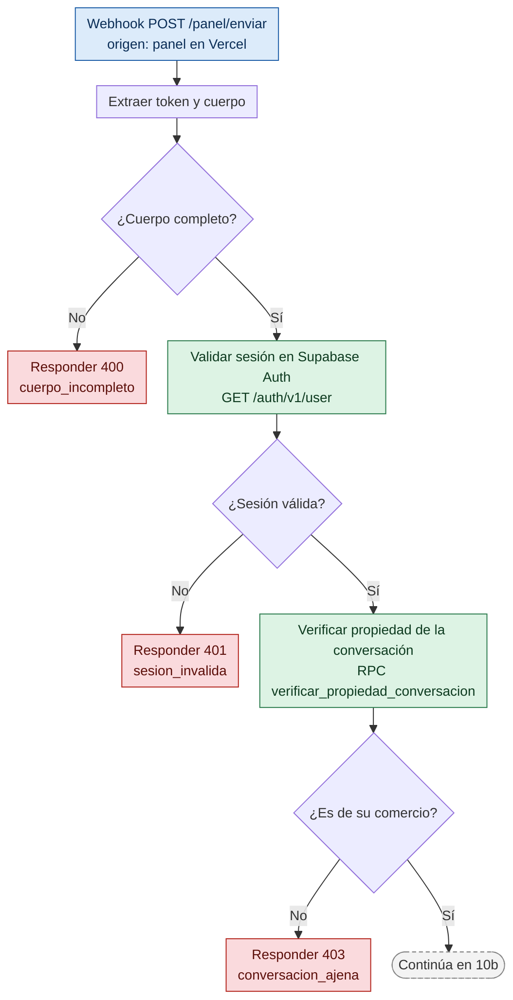
```mermaid
%%{init: {"flowchart": {"nodeSpacing": 22, "rankSpacing": 26, "padding": 6, "curve": "basis", "useMaxWidth": false}, "themeVariables": {"fontSize": "14px"}}}%%
flowchart TD
  W["Webhook POST /panel/enviar<br/>origen: panel en Vercel"]
  W --> EX["Extraer token y cuerpo"]
  EX --> CC{"¿Cuerpo completo?"}
  CC -->|No| R400["Responder 400<br/>cuerpo_incompleto"]
  CC -->|Sí| VS["Validar sesión en Supabase Auth<br/>GET /auth/v1/user"]
  VS --> SV{"¿Sesión válida?"}
  SV -->|No| R401["Responder 401<br/>sesion_invalida"]
  SV -->|Sí| VP["Verificar propiedad de la conversación<br/>RPC verificar_propiedad_conversacion"]
  VP --> EC{"¿Es de su comercio?"}
  EC -->|No| R403["Responder 403<br/>conversacion_ajena"]
  EC -->|Sí| CONT(["Continúa en 10b"])

  classDef trig fill:#DCEBFA,stroke:#1F5FA8,color:#0B2E57
  classDef sub fill:#E8E0F7,stroke:#6B4FB0,color:#2C1A5E
  classDef db fill:#DDF3E4,stroke:#2E7D4F,color:#0E3B20
  classDef ext fill:#FDE8D0,stroke:#C77700,color:#5A3300
  classDef err fill:#FADADD,stroke:#B3261E,color:#5C0F0A
  classDef nota fill:#F3F3F3,stroke:#888888,color:#333333,stroke-dasharray: 4 3
  class W trig
  class VS,VP db
  class R400,R401,R403 err
  class CONT nota
```

## Figura 20. WF-10: envío del mensaje y respuesta al panel

Archivo: `10b_WF-10_envio_y_respuesta.mmd`

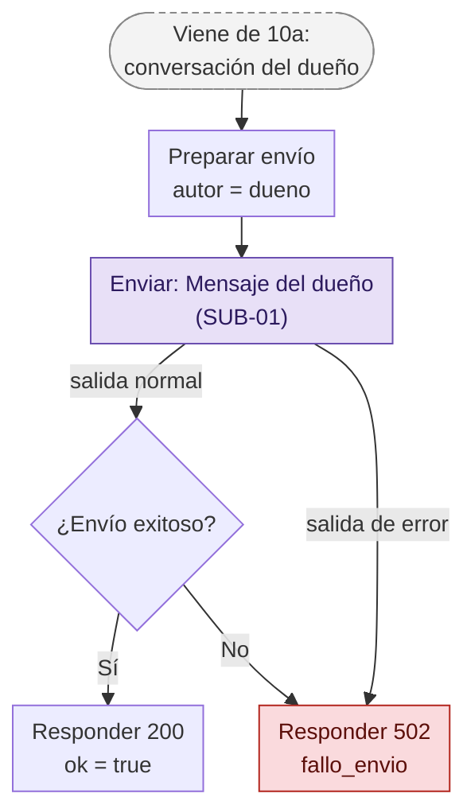
```mermaid
%%{init: {"flowchart": {"nodeSpacing": 22, "rankSpacing": 26, "padding": 6, "curve": "basis", "useMaxWidth": false}, "themeVariables": {"fontSize": "14px"}}}%%
flowchart TD
  ST(["Viene de 10a:<br/>conversación del dueño"])
  ST --> PE["Preparar envío<br/>autor = dueno"]
  PE --> EM["Enviar: Mensaje del dueño<br/>(SUB-01)"]
  EM -->|salida normal| EXI{"¿Envío exitoso?"}
  EM -->|salida de error| R502["Responder 502<br/>fallo_envio"]
  EXI -->|Sí| R200["Responder 200<br/>ok = true"]
  EXI -->|No| R502

  classDef trig fill:#DCEBFA,stroke:#1F5FA8,color:#0B2E57
  classDef sub fill:#E8E0F7,stroke:#6B4FB0,color:#2C1A5E
  classDef db fill:#DDF3E4,stroke:#2E7D4F,color:#0E3B20
  classDef ext fill:#FDE8D0,stroke:#C77700,color:#5A3300
  classDef err fill:#FADADD,stroke:#B3261E,color:#5C0F0A
  classDef nota fill:#F3F3F3,stroke:#888888,color:#333333,stroke-dasharray: 4 3
  class EM sub
  class R502 err
  class ST nota
```

## Figura 21. WF-11: tareas programadas cada 15 minutos

Archivo: `11_WF-11_tareas_programadas.mmd`

```mermaid
%%{init: {"flowchart": {"nodeSpacing": 22, "rankSpacing": 26, "padding": 6, "curve": "basis", "useMaxWidth": false}, "themeVariables": {"fontSize": "14px"}}}%%
flowchart TD
  S["Cada 15 minutos<br/>Schedule Trigger"]
  S --> A["Descartar carritos expirados (24 h)<br/>RPC descartar_carritos_expirados"]
  S --> B["Cerrar atenciones inactivas (24 h)<br/>RPC cerrar_atenciones_inactivas"]
  S --> C["Listar avisos pendientes<br/>RPC listar_avisos_pendientes"]
  C --> D{"¿Hay avisos pendientes?"}
  D -->|Sí| R["Reintentar en WF-09<br/>una ejecución por aviso"]

  classDef trig fill:#DCEBFA,stroke:#1F5FA8,color:#0B2E57
  classDef sub fill:#E8E0F7,stroke:#6B4FB0,color:#2C1A5E
  classDef db fill:#DDF3E4,stroke:#2E7D4F,color:#0E3B20
  classDef ext fill:#FDE8D0,stroke:#C77700,color:#5A3300
  classDef err fill:#FADADD,stroke:#B3261E,color:#5C0F0A
  class S trig
  class A,B,C db
  class R sub
```

## Figura 22. WF-12: registro, alerta y contingencia

Archivo: `12_WF-12_errores_y_contingencia.mmd`

```mermaid
%%{init: {"flowchart": {"nodeSpacing": 22, "rankSpacing": 26, "padding": 6, "curve": "basis", "useMaxWidth": false}, "themeVariables": {"fontSize": "14px"}}}%%
flowchart TD
  ET["Error Trigger<br/>falla en cualquier flujo"]
  ET --> CF["Configuración<br/>workflows_cliente, comercio_id,<br/>phone_number_id"]
  CF --> PD["Preparar datos del error<br/>es_flujo_cliente"]
  PD --> RE["Registrar en eventos_error<br/>POST eventos_error"]
  PD --> AD["Alertar al dueño<br/>RPC crear_alerta"]
  PD --> EC{"¿Error de flujo<br/>de cliente?"}
  EC -->|No| EI["Error interno:<br/>solo registro y alerta"]
  EC -->|Sí| BU["Buscar último cliente sin respuesta<br/>RPC ultimo_cliente_sin_respuesta"]
  BU --> HC{"¿Hay cliente<br/>afectado?"}
  HC -->|No| SC["Sin cliente identificable:<br/>solo registro y alerta"]
  HC -->|Sí| AC["Armar: Contingencia<br/>botones Menú / Hablar con persona"]
  AC --> EN["Enviar: Contingencia<br/>(SUB-01)"]

  classDef trig fill:#DCEBFA,stroke:#1F5FA8,color:#0B2E57
  classDef sub fill:#E8E0F7,stroke:#6B4FB0,color:#2C1A5E
  classDef db fill:#DDF3E4,stroke:#2E7D4F,color:#0E3B20
  classDef ext fill:#FDE8D0,stroke:#C77700,color:#5A3300
  classDef err fill:#FADADD,stroke:#B3261E,color:#5C0F0A
  class ET err
  class EN sub
  class RE,AD,BU db
```

## Figura 23. SUB-01: construcción, envío y registro del mensaje

Archivo: `13_SUB-01_enviar_telegram.mmd`

```mermaid
%%{init: {"flowchart": {"nodeSpacing": 22, "rankSpacing": 26, "padding": 6, "curve": "basis", "useMaxWidth": false}, "themeVariables": {"fontSize": "14px"}}}%%
flowchart TD
  E["Entrada<br/>comercio, mensaje, wa,<br/>autor, guardar_contenido"]
  E --> AP["Armar payload Telegram<br/>texto, botones, lista o plantilla"]
  AP --> TV{"¿Tipo de mensaje<br/>válido?"}
  TV -->|No| RTI["Resultado: tipo inválido<br/>enviado = false"]
  TV -->|Sí| CB{"¿Cuántos botones?<br/>0 a 5"}
  CB -->|0| T0["Enviar por Telegram"]
  CB -->|"1 a 5"| T5["Enviar por Telegram<br/>(1 a 5 botones, un nodo por cantidad)"]
  T0 --> OK{"¿Envío correcto?<br/>result.message_id"}
  T5 --> OK
  OK -->|Sí| PR["Preparar registro"]
  PR --> RM["Registrar mensaje saliente<br/>RPC registrar_mensaje_saliente"]
  RM --> RE["Resultado: enviado<br/>enviado = true"]
  OK -->|No| REE["Registrar error de envío<br/>POST eventos_error"]
  REE --> RF["Resultado: falló el envío<br/>enviado = false"]

  classDef trig fill:#DCEBFA,stroke:#1F5FA8,color:#0B2E57
  classDef sub fill:#E8E0F7,stroke:#6B4FB0,color:#2C1A5E
  classDef db fill:#DDF3E4,stroke:#2E7D4F,color:#0E3B20
  classDef ext fill:#FDE8D0,stroke:#C77700,color:#5A3300
  classDef err fill:#FADADD,stroke:#B3261E,color:#5C0F0A
  class E trig
  class T0,T5 ext
  class RM,REE db
  class RTI,RF err
```

